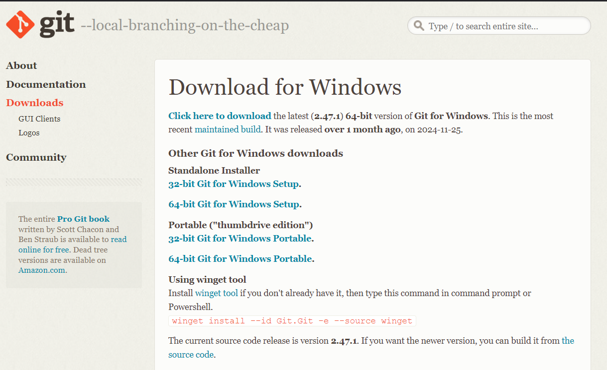
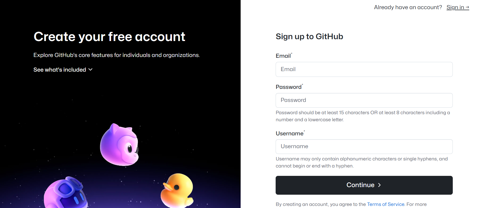
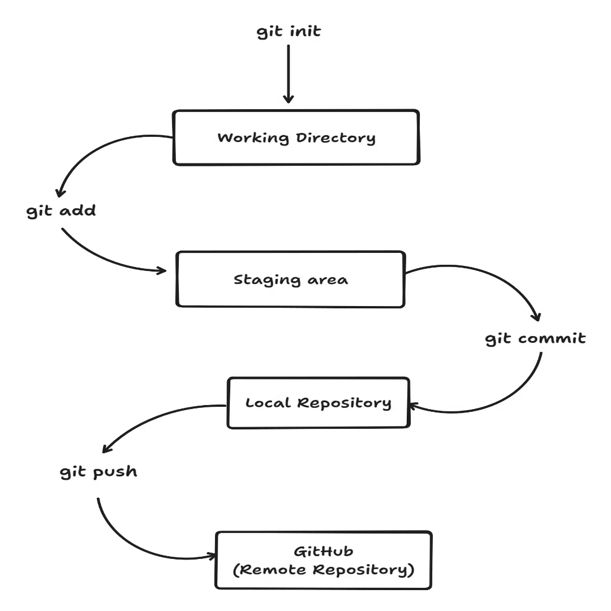

# 🌟 Welcome to Git and GitHub at **ChaiCode Cohort**! 🌟  

  

---

## 🚀 Introduction  
Welcome to the **ChaiCode Cohort!** As a developer, you'll use **Git** and **GitHub** extensively to manage code and collaborate with your team.  

### What You’ll Learn:  
✅ **Set up Git and GitHub**  
✅ **Master essential Git commands**  
✅ **Follow best practices for seamless teamwork**  

---

## 🛠️ Installation and Setup  

### **Installing Git**  

#### 📌 **Windows**  
1. **Download [Git](https://git-scm.com/)**  
    
2. Run the installer.  
3. Verify the installation:  

   ```bash
   git --version
   ```


#### 🍎 **macOS**  
1. Open **Terminal**.  
2. Install Git using Homebrew:  

   ```bash
   brew install git
   ```  

3. Verify the installation:  
  


#### 🐧 **Linux**  
1. Update your package list:  

   ```bash
   sudo apt update
   ```  

2. Install Git:  

   ```bash
   sudo apt install git
   ```  

3. Verify the installation:  
    

---

### **Configuring Git**  

After installation, configure Git with your credentials:  

```bash
git config --global user.name "Your Name"
git config --global user.email "your.email@example.com"
```  

---

### **Creating a GitHub Account**  
1. Go to [GitHub](https://github.com/).  
   
2. Click **Sign Up** and complete the registration process.  
      
3. Verify your email to activate your account.  

---

## 📥 Cloning the ChaiCode Repository  

1. Navigate to the repository on GitHub.  
2. Copy the repository URL.  
3. Clone the repository:  

   ```bash
   git clone https://github.com/ShivamPatel145/Chai-Code-Cohort.git
   ```  

4. Navigate into the project folder:  

   ```bash
   cd Chai-Code-Cohort
   ```  

---

## ⚡ Basic Git Commands  

| **Command**            | **Purpose**                                   |  
|-------------------------|-----------------------------------------------|  
| `git status`           | Check the current state of the repository.    |  
| `git add`              | Stage changes for the next commit.            |  
| `git commit -m`        | Save changes with a descriptive message.      |  
| `git push`             | Upload changes to the remote repository.      |  
| `git pull`             | Sync your code with the latest updates.       |  
| `git log`              | View the commit history.                      |  

### 🔑 Example Workflow  

```bash
git status
git add .
git commit -m "feat: Add project setup"
git push
git pull
git log
```  



---

## 📝 Commit Message Guidelines  

Follow these best practices:  
- Use **present tense** (e.g., "Add," not "Added").  
- Capitalize the first word.  
- Keep it short (50 characters or less).  
- Use prefixes like:  
  - `feat`: New feature.  
  - `fix`: Bug fix.  
  - `docs`: Documentation updates.  

### **Examples**  

```bash
feat: Add tea selection feature  
fix: Resolve login page crash  
docs: Update README with chai varieties  
```  

---

## 🌿 Branching Workflow  

### **Branch Strategy**  

- **main**: Stable production code.  
- **development**: Latest working code.  
- **feature/**: Feature-specific branches.  

### **Creating and Switching Branches**  

```bash
git branch feature/new-feature
git checkout feature/new-feature
```  


---

## 🔄 Pull Requests (PRs)  

### **Steps to Create a Pull Request**  

1. Push your branch to GitHub:  

   ```bash
   git push origin feature/new-feature
   ```  

2. On GitHub, navigate to **Pull Requests**.  
3. Click **New Pull Request**.  
4. Add a clear description and request reviews from teammates.  
 

---

## ✅ Best Practices  

1. Commit frequently and meaningfully.  
2. Pull changes often to avoid conflicts.  
3. Review and test your code before pushing.  
4. Keep branches focused on specific tasks.  
5. Actively review and comment on PRs.  

---

## 📚 Resources  

- Explore [GitHub Docs](https://docs.github.com/) for detailed guidance.   
- Checkout My [Blog](https://mastering-git-and-github.hashnode.dev/) on Git-Github.
## 🌟 **Happy Coding at ChaiCode!** 🌟  

---
By following this guide, you will be well-equipped to use Git and GitHub effectively within the ChaiCode Cohort. Happy coding!
